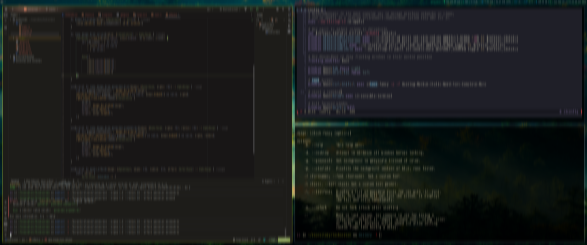
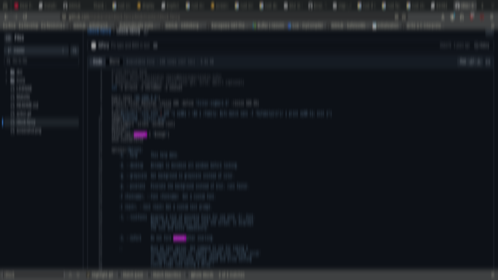

# Lockscreen

Create an effected lockscreen for the I3 desktop.




# Prerequisites

`i3` or `i3-gaps` with `i3lock` as default desktop locker.

For more information on getting started with i3 see their documentation [here](https://i3wm.org/docs/userguide.html).

# Installation

Build release from source and install from project directory.

```shell
cargo install --path .
```

Add lockscreen to your i3 config. I prefer this binding for my lockscreen, but you can use whatever is comfortable.
My mod key is `Mod1` or left alt.

```shell
bindsym $mod+Ctrl+Shift+l exec lockscreen -s 1.5 -r 2.0 -e gaussian-asymmetric
```

## Dependencies

* [clap](https://crates.io/crates/clap/4.6.1) for command line argument parsing
* [fastblur](https://crates.io/crates/fastblur/0.1.1) for fast Gaussian blur effects
* [image](https://crates.io/crates/image/0.25.10) for image related manipulation 
* [screenshots](https://crates.io/crates/screenshots/0.8.10) for desktop screen capturing

# Blur Types

Currently, only supports three blur types.

* Gaussian

* Gaussian Asymmetric

* Pixelate

Gaussian and Gaussian Asymmetric effects provided by the [fastblur](https://crates.io/crates/fastblur) library.